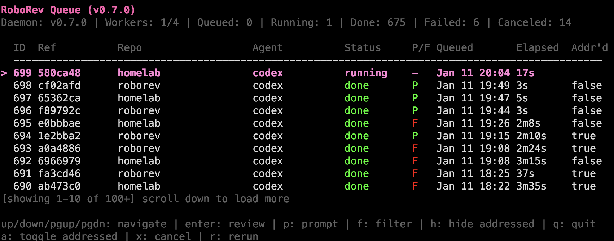
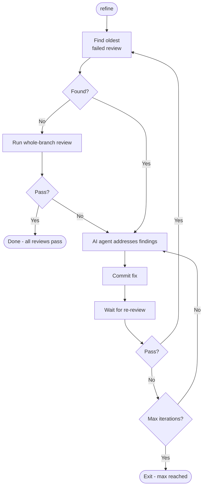

# roborev

Automatic code review for git commits using AI agents (Claude Code, Codex, Gemini, Copilot, OpenCode).



## Installation

```bash
curl -fsSL https://raw.githubusercontent.com/wesm/roborev/main/scripts/install.sh | bash
```

Or with Go:

```bash
go install github.com/wesm/roborev/cmd/roborev@latest
go install github.com/wesm/roborev/cmd/roborevd@latest
```

Ensure `$GOPATH/bin` is in your PATH:

```bash
export PATH="$PATH:$(go env GOPATH)/bin"
```

## Quick Start

```bash
cd your-repo
roborev init          # Install post-commit hook
git commit -m "..."   # Reviews happen automatically
roborev tui           # View reviews in interactive UI
```

**Note**: Hook installation automatically detects your git hook manager (Husky, etc.) via `core.hooksPath`.

## Commands

| Command | Description |
|---------|-------------|
| `roborev init` | Initialize roborev in current repo |
| `roborev status` | Show daemon and queue status |
| `roborev tui` | Interactive terminal UI |
| `roborev show [sha]` | Display review for commit |
| `roborev show --job <id>` | Display review by job ID |
| `roborev review <sha>` | Queue a commit for review |
| `roborev review <start> <end>` | Queue a commit range (inclusive) |
| `roborev review --branch` | Review all commits on current branch |
| `roborev review --since <commit>` | Review commits since a specific commit |
| `roborev review --dirty` | Review uncommitted changes |
| `roborev review --reasoning <level>` | Set reasoning depth (thorough/standard/fast) |
| `roborev prompt "<text>"` | Run ad-hoc prompt with AI agent |
| `roborev respond <id> [msg]` | Add a response/note to a review |
| `roborev address <id>` | Mark review as addressed |
| `roborev refine` | Auto-fix failed reviews using AI |
| `roborev repo list` | List tracked repositories |
| `roborev repo rename <old> <new>` | Rename a repository's display name |
| `roborev stream` | Stream review events (JSONL) |
| `roborev daemon start\|stop\|restart` | Manage the daemon |
| `roborev install-hook` | Install git post-commit hook |
| `roborev uninstall-hook` | Remove git post-commit hook |
| `roborev update` | Update roborev to latest version |
| `roborev skills install` | Install agent skills (Claude Code, Codex) |
| `roborev version` | Show version information |

## Reviewing Branches

Use `--branch` to review all commits since your branch diverged from main:

```bash
roborev review --branch              # Review branch vs auto-detected main/master
roborev review --branch --base dev   # Review branch vs specific base
roborev review --branch --wait       # Wait for review and show result
```

This is useful for pre-merge reviews of entire feature branches.

## Reviewing Specific Commits

Use `--since` to review commits since a specific point:

```bash
roborev review --since HEAD~5       # Review last 5 commits
roborev review --since abc123       # Review commits since abc123 (exclusive)
roborev review --since v1.0.0       # Review commits since a tag
```

The range is exclusive of the starting commit (like git's `..` range syntax). Unlike `--branch`, this works on any branch including main.

## Reviewing Uncommitted Changes

Use `--dirty` to review working tree changes before committing:

```bash
roborev review --dirty           # Queue review of uncommitted changes
roborev review --dirty --wait    # Wait for review and show result
```

Includes staged changes, unstaged changes to tracked files, and untracked files.

The `--wait` flag exits with code 0 for passing reviews and code 1 for failing reviews, useful for CI:

```bash
if ! roborev review --dirty --wait --quiet; then
    echo "Review failed - please address findings"
    exit 1
fi
```

## Ad-Hoc Prompts

Use `prompt` to run arbitrary prompts with AI agents for tasks beyond code review:

```bash
roborev prompt "Explain the architecture of this codebase"
roborev prompt --wait "What does the main function do?"
roborev prompt --agent claude-code "Refactor error handling in main.go"
roborev prompt --reasoning thorough "Find potential security issues"
cat instructions.txt | roborev prompt --wait
```

**Flags:**

| Flag | Description |
|------|-------------|
| `--wait` | Wait for job to complete and show result |
| `--agent` | Agent to use (default: from config) |
| `--reasoning` | Reasoning level: fast, standard, or thorough |
| `--no-context` | Don't include repository context in prompt |
| `--quiet` | Suppress output (just enqueue) |

By default, prompts include context about the repository (name, path, and any project guidelines from `.roborev.toml`). Use `--no-context` for raw prompts.

## Repository Management

Manage repositories tracked by roborev:

```bash
roborev repo list                    # List all repos with review counts
roborev repo show my-project         # Show repo details and stats
roborev repo rename old-name new-name # Rename display name
roborev repo delete old-project      # Remove from tracking
roborev repo merge source target     # Merge reviews into another repo
```

**Subcommands:**

| Command | Description |
|---------|-------------|
| `repo list` | List all repositories with review counts |
| `repo show <name>` | Show detailed stats for a repository |
| `repo rename <old> <new>` | Rename a repository's display name |
| `repo delete <name>` | Remove repository from tracking |
| `repo merge <src> <dst>` | Move all reviews to another repo |

The rename command is useful for grouping reviews after project renames or when you want a friendlier display name than the directory name. The merge command consolidates duplicate entries (e.g., from symlinks or path changes).

## Auto-Fixing Failed Reviews

Use `refine` to automatically address failed reviews on your branch:

```bash
roborev refine                       # Fix failed reviews using default agent
roborev refine --agent claude-code   # Use specific agent for addressing findings
roborev refine --max-iterations 5    # Limit fix attempts
roborev refine --quiet               # Show elapsed time instead of agent output
roborev refine --reasoning thorough  # Use thorough reasoning (slower, more accurate)
roborev refine --since abc123        # Refine commits since a specific commit
roborev refine --since HEAD~3        # Refine the last 3 commits (works on main branch)
```



The loop processes commits oldest-first. When a fix fails review, it keeps addressing that fix until it passes before moving to the next oldest failed commit. Passing reviews are automatically marked as addressed. When no individual failed reviews remain, a whole-branch review runs; if that passes, the refiner exits successfully.

Requires a clean working tree. By default, refine works on feature branches (comparing against main). Use `--since` to refine specific commits on any branch, including main.

### Security Considerations

The refine command runs AI agents **without sandboxing** so they can install dependencies, run builds, and execute tests. This is safe for your own code, but use caution with untrusted sources:

| Scenario | Risk Level | Recommendation |
|----------|------------|----------------|
| Your own branches | Low | Safe to run directly |
| PRs from trusted contributors | Low-Medium | Review changes before refining |
| PRs from strangers / untrusted code | High | Use isolation (see below) |

**Isolation options for untrusted code:**
- Run in a container or VM
- Use a low-privilege user account
- Use a disposable cloud instance

The risk is equivalent to running `claude --dangerously-skip-permissions` or `codex --dangerously-bypass-approvals-and-sandbox` manually - malicious code could potentially access credentials, exfiltrate data, or modify your system.

## Configuration

### Per-Repository

Create `.roborev.toml` in your repo root:

```toml
agent = "claude-code"      # AI agent to use
review_context_count = 5   # Recent reviews to include as context
display_name = "backend"   # Custom name shown in TUI (optional)
excluded_branches = ["wip", "scratch"]  # Branches to skip reviews on

# Reasoning levels: thorough, standard, fast
review_reasoning = "thorough"  # For code reviews (default: thorough)
refine_reasoning = "standard"  # For refine command (default: standard)

# Project-specific review guidelines
review_guidelines = """
No database migrations needed - no production databases yet.
Prefer composition over inheritance.
All public APIs must have documentation comments.
"""
```

### Global

Create `~/.roborev/config.toml`:

```toml
default_agent = "codex"
server_addr = "127.0.0.1:7373"
max_workers = 4
job_timeout = "10m"  # Per-job timeout (default: 10m)
```

Override the data directory with `ROBOREV_DATA_DIR`:

```bash
export ROBOREV_DATA_DIR=/custom/path  # Default: ~/.roborev
```

### Authentication

**Claude Code** uses your Claude subscription by default. roborev deliberately ignores `ANTHROPIC_API_KEY` from the environment to avoid unexpected API charges.

To use Anthropic API credits instead:

```toml
# ~/.roborev/config.toml
anthropic_api_key = "sk-ant-..."
```

**Codex** uses the authentication configured in your Codex installation.

### Priority Order

1. CLI flags (`--agent`, `--reasoning`)
2. Per-repo `.roborev.toml`
3. Global `~/.roborev/config.toml`
4. Auto-detect first available agent; defaults to thorough for reviews, standard for refine

### Reasoning Levels

Control how deeply the AI analyzes code:

| Level | Description | Best For |
|-------|-------------|----------|
| `thorough` | Deep analysis with extended thinking | Code reviews (default) |
| `standard` | Balanced analysis | Refine command (default) |
| `fast` | Quick responses | Rapid feedback |

Override per-command:

```bash
roborev review --reasoning fast      # Quick review
roborev refine --reasoning thorough  # Careful fixes
```

The reasoning level maps to agent-specific features (Codex only today):
- **Codex**: `model_reasoning_effort` (high/medium/low)
- **Claude Code**: Not yet applied (value stored only)
- **Other agents**: Not yet applied (value stored only)

### Review Guidelines

Use `review_guidelines` to give the AI reviewer project-specific context:

- Suppress irrelevant warnings ("no migrations needed yet")
- Enforce conventions ("use tabs not spaces")
- Add domain criteria ("check for PII exposure")

### Large Diffs

When a commit diff exceeds 250KB, roborev omits it from the prompt and provides only the commit hash. The AI agent can then inspect changes using its own tools (`git show <sha>`).

For `--dirty` reviews, diffs are limited to 200KB since uncommitted changes cannot be easily inspected by the agent. If your dirty diff exceeds this limit, commit your changes in smaller chunks.

## Agents

| Agent | CLI Command | Install |
|-------|-------------|---------|
| `codex` | `codex` | `npm install -g @openai/codex` |
| `claude-code` | `claude` | `npm install -g @anthropic-ai/claude-code` |
| `gemini` | `gemini` | `npm install -g @google/gemini-cli` |
| `copilot` | `copilot` | `npm install -g @github/copilot` |
| `opencode` | `opencode` | `npm install -g opencode-ai` |

roborev auto-detects installed agents and falls back in order: codex → claude-code → gemini → copilot → opencode.

## Agent Skills

Install slash commands that let AI agents fix review findings directly:

```bash
roborev skills install
```

| Skill | Description |
|-------|-------------|
| `/roborev:address <job_id>` | Fetch a review and fix its findings |
| `/roborev:respond <job_id> [message]` | Add a response to document changes |

When you receive a review notification like "Review #1019: Fail", ask your agent:

```
/roborev:address 1019
```

The agent fetches the review, reads relevant files, fixes issues by priority (high severity first), runs tests, and offers to commit. Skills are updated automatically with `roborev update`.

For Codex, use `$roborev:address` and `$roborev:respond` instead.

## TUI

The interactive terminal UI (`roborev tui`) provides a real-time view of the review queue.

**Queue View:**

| Key | Action |
|-----|--------|
| `↑`/`k`, `↓`/`j` | Navigate jobs |
| `PgUp`, `PgDn` | Page through list |
| `Enter` | View review |
| `p` | View prompt |
| `a` | Toggle addressed |
| `x` | Cancel running/queued job |
| `r` | Rerun completed/failed/canceled job |
| `f` | Filter by repository |
| `h` | Hide addressed/failed/canceled |
| `Esc` | Clear all filters |
| `q` | Quit |

Filter to a single repository with `f`, or hide completed reviews with `h` to focus on items needing attention


**Review/Prompt View:**

| Key | Action |
|-----|--------|
| `↑`/`k`, `↓`/`j` | Scroll content |
| `←`/`h`, `→`/`l` | Previous/next review |
| `PgUp`, `PgDn` | Page through content |
| `a` | Toggle addressed |
| `p` | Switch between review/prompt |
| `Esc`, `q` | Back to queue |

Reviews display a **Verdict** (Pass/Fail) parsed from the AI response, with color coding for quick triage.


## Streaming Events

Stream review events in real-time for integrations, notifications, or custom tooling:

```bash
roborev stream              # Stream all events
roborev stream --repo .     # Stream events for current repo only
```

Events are emitted as newline-delimited JSON (JSONL):

```json
{"type":"review.started","ts":"2025-01-11T10:00:00Z","job_id":42,"repo":"/path/to/repo","repo_name":"myrepo","sha":"abc123","agent":"codex"}
{"type":"review.completed","ts":"2025-01-11T10:01:30Z","job_id":42,"repo":"/path/to/repo","repo_name":"myrepo","sha":"abc123","agent":"codex","verdict":"P"}
```

**Event types:**

| Type | Description |
|------|-------------|
| `review.started` | Review job started processing |
| `review.completed` | Review finished successfully |
| `review.failed` | Review failed (includes `error` field) |
| `review.canceled` | Review was canceled |

Use with tools like `jq` for filtering:

```bash
roborev stream | jq -c 'select(.type == "review.completed")'
```

## Git Worktrees

roborev fully supports git worktrees. Reviews are stored against the main repository, so commits made in any worktree are associated with the same review history.

```bash
# In main repo
git worktree add ../feature-branch feature-branch
cd ../feature-branch

# Reviews work normally - they're stored under the main repo
roborev review --branch
roborev refine
roborev tui
```

When running commands from a worktree:
- Reviews are stored using the main repository path (not the worktree path)
- The TUI shows all reviews for the repository regardless of which worktree you're in
- `refine` correctly finds and addresses reviews for commits in any worktree

This is handled automatically - no configuration needed.

## Architecture

roborev runs as a local daemon that processes review jobs in parallel:

```
~/.roborev/
├── config.toml    # Global configuration
├── daemon.json    # Runtime state (port, PID)
└── reviews.db     # SQLite database
```

The daemon starts automatically when needed and handles port conflicts gracefully.

## Development

```bash
git clone https://github.com/wesm/roborev
cd roborev
go test ./...
make install    # Installs with version info (e.g., v0.7.0-5-gabcdef)
```

Or use `go install ./cmd/...` for quick iteration (version shows commit hash only).

## License

MIT
